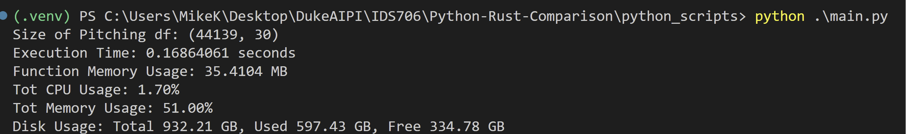
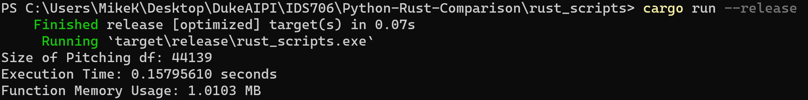

# Comparing Rust and Python Performance

[](https://github.com/mkeohane01/Python-Rust-Comparison/actions/workflows/main.yml)

- Compare the time and memory usage for similar python and rust scripts.
- Comparing a function loading then sorting a baseball pitching data set
    - In python uses pandas to load and sort
    - In Rust uses csv::ReaderBuilder
    -  data/Pitching.csv
    -  Size = 44139 rows

## Python
#### Usage
- ```python main.py```
#### Output


## Rust
#### Usage
- ```cargo build``` 
- ```cargo run --release```
#### Output


### Comparison
| Metric | Python | Rust | Ratio (Python / Rust) |
|--------|--------|------|-----------------------|
| Time (s) | 0.1686 | 0.1579 | 1.068 |
| Memory (MBs) | 35.41 | 1.01 | 35 |

### Conclusion
- Rust is both faster and more memory efficient than python
- Without more tests cannot confidently say by how much.
- I predict with much larger data sets, Rust will perform vastly better than python at processing.
